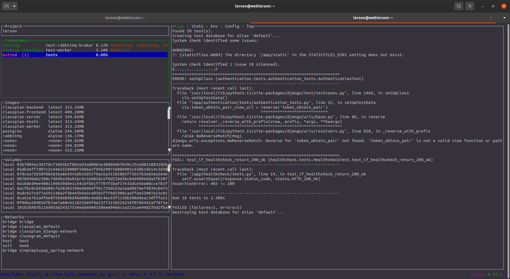
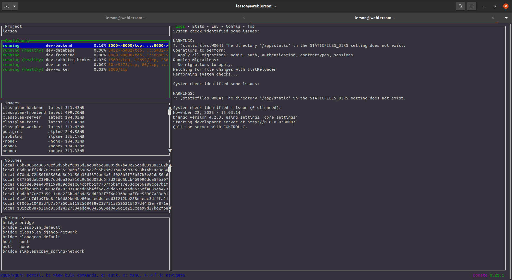
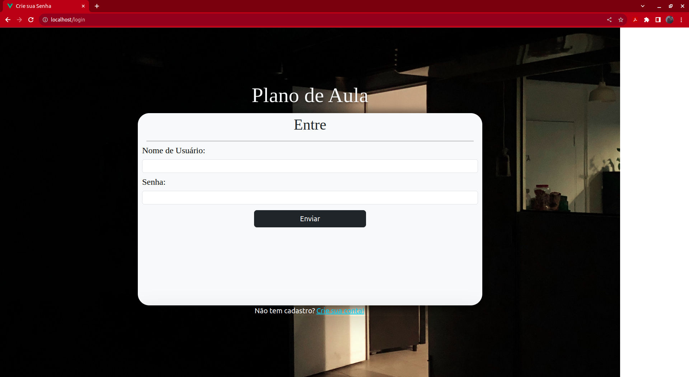
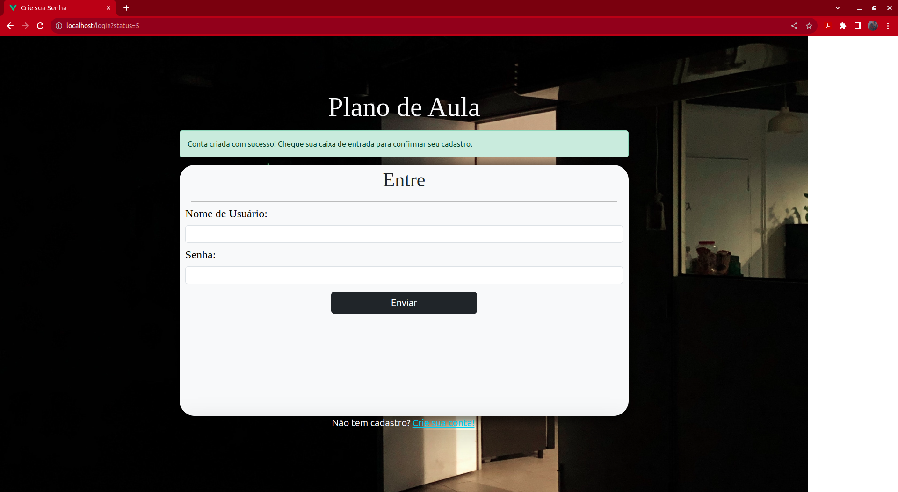
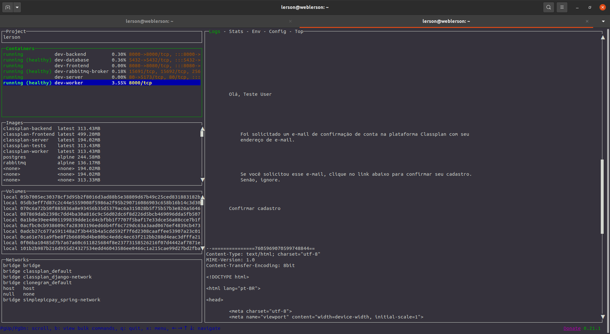
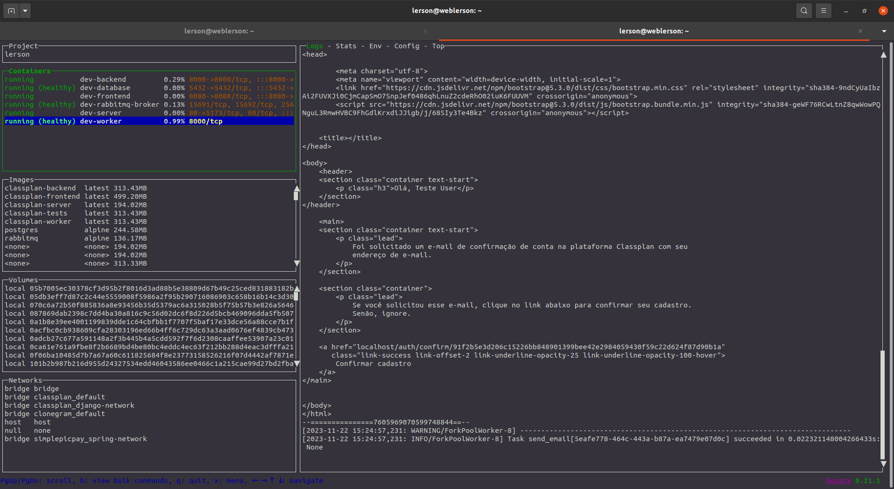
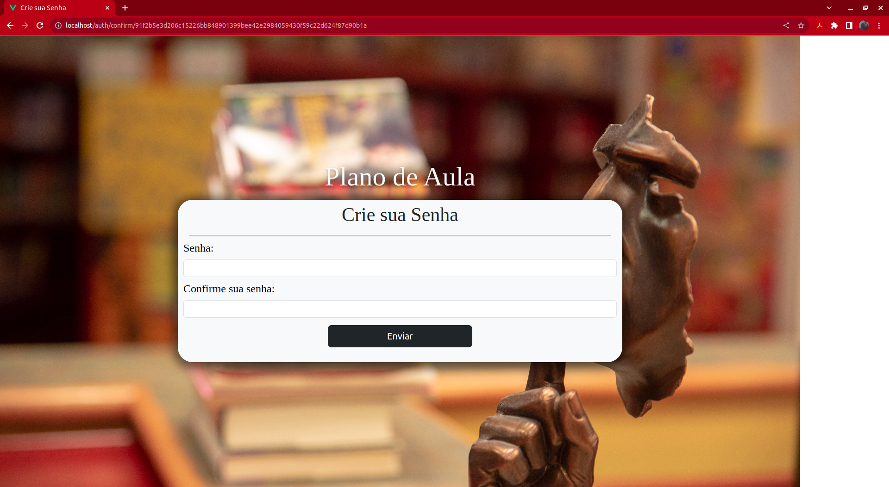
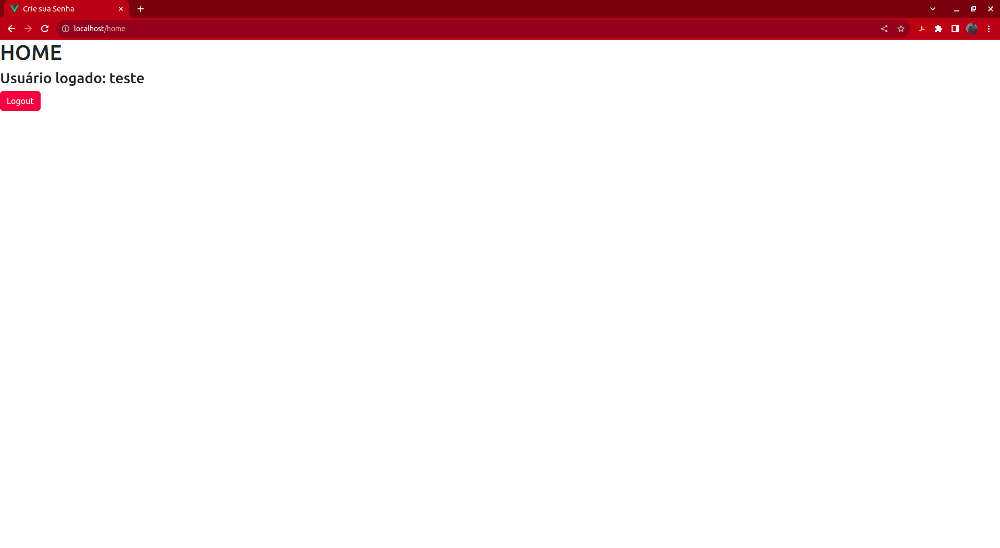

# Classplan
Como o nome não sugere, não é um site sobre planejamento de aulas, mas sim uma
plataforma de planejamento de atividades privadas ou compartilhadas.

Como assim? Imagine uma plataforma de planejamento, como uma ToDo List, porém com
a possibilidade de criar "salas" compartilhadas além da sua pessoao para dividir o
planejamento com outra pessoa em tempo real, podendo até mesmo cumprir alguns desses
planos, como assistir à um vídeo dentro da plataforma.

### Tecnologias Utilizadas
As tecnologias utilizadas para o desenvolvimento até a saída atual são:

- Python
- Pipenv
- Django e Django REST Framework
- HTML, CSS e JavaScript
- Vue.js
- Servidor Web NginX
- Celery
- PostgreSQL e RabbitMQ
- Docker e Docker Compose
- Git

### Instalação
#### Antes de instalar
Antes de instalar, é necessário verificar se possui instalado em sua máquina as ferramentas para
executar os ambientes. Além disso, os passos a seguir, aqui, foram pensados para o sistema operacional
Linux.

Para isso, instale o Git, Docker e Docker Compose nos links abaixo:

__Git CLI:__ [Git CLI](https://git-scm.com/downloads)

__Docker Engine:__ [Docker Engine](https://docs.docker.com/engine/install/ubuntu/)

__Docker Compose:__ [Docker Compose](https://docs.docker.com/compose/install/linux/)

__LazyDocker:__ [LazyDocker](https://github.com/jesseduffield/lazydocker)

*O LazyDocker não é um requisito necessário para executar a aplicação, mas é muito útil para monitorar
e gerenciar os containers. Por isso, considere instalar a ferramenta.*

<hr>

Como instalar a versão atual mais estável?
Basta clonar o projeto da branch master.

Para clonar o projeto usando HTTPs, use o seguinte comando:
```shell
git clone https://github.com/weblerson/classplan.git
```

Para clonar o projeto usando SSH, use o comando:
```shell
git clone git@github.com:weblerson/classplan.git
```

<hr>

### Ambiente de Testes
Para rodar o perfil de testes, basta navegar até a raiz do projeto e digitar o 
seguinte comando:
```shell
docker compose -f docker-compose.test.yaml --env-file test.env up --build -d
```
Agora, o perfil de testes da aplicação irá subir com todas as dependências necessárias somente com
um único comando. Veja:


Navegando pelos containers abertos usando o LazyDocker, existe o container chamado
"tests", em que você pode ver todos os logs de dentro daquele container.

### Ambiente de Desenvolvimento
Para rodar o perfil de desenvolvimento, é análogo à execução do perfil de testes.
Basta digitar o comando:
```shell
docker compose -f docker-compose.dev.yaml --env-file dev.env up --build -d
```
Então, verificando o painel do LazyDocker, teremos isso:


Agora, temos acesso a todos os serviços em pé no perfil de desenvolvimento, que
simula o perfil de produção, e é esse perfil que iremos utilizar.

<hr>

Pronto! O perfil de desenvolvimento está sendo executado no localhost e possui
um servido web provendo todos os arquivos e fazendo o proxy reverso ao backend.

Para acessar, basta ir ao seu navegador e digitar *__http://localhost__* e será
redirecionado para o site local.


*Correções na interface serão feitas gradualmente.*

__A partir daqui, pode usar a aplicação normalmente. Porém, vale ressaltar uma
peculiaridade da aplicação:__

### Emails
Quando alguém realiza o cadastro no site, o comportamento padrão é um e-mail
ser enviado para quem solicitou o cadastro. Porém, como o ambiente em execução
é o de desenvolvimento, a função de envio de e-mail padrão está desativada e só
acontece ao nível de console.

Então, caso crie uma conta, você receberá o alerta de conta criada:



Por isso, você deve monitorar o email no serviço chamado "dev-worker":


Mais abaixo no log do container, tem o html do email. Nele, você vai encontrar
um link com um token, perto do final:


Você deve copiar esse link no seu navegador, então terá acesso à página de criação
de senha, para criar a senha da sua conta e ativá-la.


Depois de criar a senha, você será redirecionado para a página de login e poderá
realizar login normalmente:




<hr>

### Fim, por enquanto
Estou trabalhando nas futuras atualizações do site.
